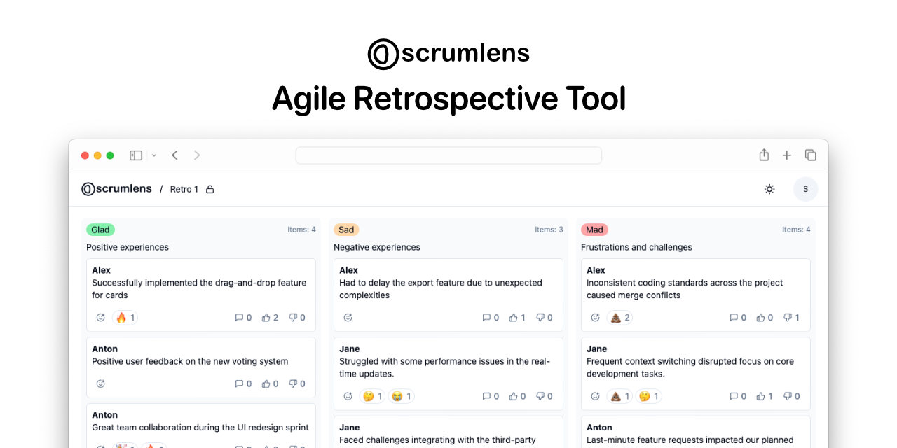

<p align="center">
  
</p>

<h1 align="center">Scrumlens</h1>

<p align="center">
  <strong>Agile Retrospective Tool</strong>
  <br>
  Retrospectives that actually move the needle.
  <br>
  Open-source, real-time, and designed to make your team's voice heard loud and clear
</p>

<p align="center">
  
  
</p>

<p align="center">
  <a href="https://scrumlens.com">Website</a> |
  <a href="https://github.com/scrumlens/scrumlens/blob/main/CHANGELOG.md">Change Log</a>
</p>

<p align="center">
  ⭐️ Your star shines on us. Star us on GitHub!
</p>

> [!CAUTION]
> Project is currently in an active development stage.
> We strongly recommend using our app for familiarization purposes only at this time. This will allow you to get acquainted with the main features and capabilities of our project, without risking the occurrence of unexpected situations.

TODO: write a detailed README

## Pre-requisites

Before proceeding, ensure that your system meets the following requirements:

- [Bun](https://bun.sh/) - Build tool and runtime
- [MongoDB](https://www.mongodb.com/docs/manual/administration/install-community/) - Database

## Development

```
# Install dependencies
bun install

# Run the app
bun run dev
```

- Client available at http://localhost:3000
- Server available at http://localhost:3030
- API docs available at http://localhost:3030/swagger

### Structure

The project is monorepo with folders:

- `/apps/client` - Nuxt app
- `/apps/server` - Elysia app

## Roadmap

- [x] Private boards & invitation system
- [ ] Participants ban system
- [ ] Comments system
- [x] Locking board
- [ ] Polling
- [ ] Timers
- [x] Gifs in notes
- [ ] Export board data to PDF, CSV, etc.

## Follow
 - News and updates on [X](https://twitter.com/anton_reshetov).

## License

[AGPL-3.0](https://github.com/scrumlens/scrumlens/blob/main/LICENSE)

Copyright (c) 2024-present, [Anton Reshetov](https://github.com/antonreshetov).
